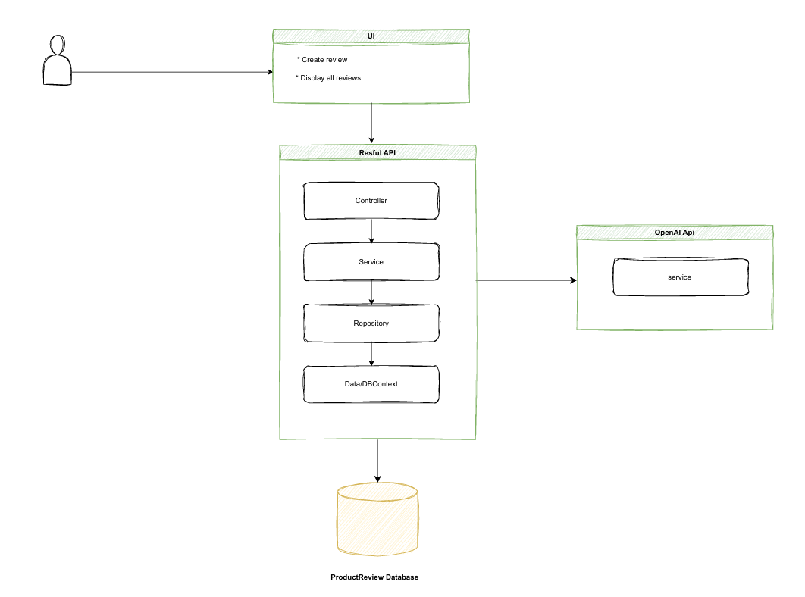

<div align="center">
  <h1>
       Product Review Analysis BACK END
  </h1>
  <p>
    A Layered architected .NET application designed to analyze customer product reviews. The is also OpenAI intergration - extract insights, and provide sentiment analysis reports. Built using Layered Architecture principles for scalability, testability, and maintainability.
    <br/><br/>
    This project demonstrates UserInput-driven design, repository-service-controller layering, and integrated testing with NUnit and Stryker for mutation test coverage.
  </p>
</div>

---

# Key Features

* **Review Management:** Store, fetch, and manage product reviews in a SQLite database.
* **Sentiment Analysis:** Evaluate customer reviews for positive, neutral, or negative sentiment (configurable in service layer).
* **Product Repository:** Clean repository pattern for database access using EF Core.
* **RESTful API Layer:** ASP.NET Core Web API following Clean Architecture principles.
* **NUnit Testing:** Unit tests for repositories, services, and controllers.
* **Mutation Testing (Stryker):** Ensures test quality and code robustness.
* **SQLite Integration:** Lightweight and cross-platform database support.

---

# Project Structure
```bash
ProductReviewAnalysis/
│
├── ProductReviewAnalysis.Api/ # ASP.NET Core Web API controllers,  Services
│ ├── Controllers/
│ ├── Program.cs
│ └── appsettings.json
│ 
│
├── ProductReviewAnalysis.Common/ # Interfaces  and  DTOs
│ ├
│ └── Interfaces/
│ └── DTOs/
|
│── ProductReviewAnalysis.Daya/ # Entities, EF Core setup, and DbContext
│ ├
│ └── Database/
│ └── Models/
|
├── ProductReviewAnalysis.Repository/ # Repositories
│ ├── Repositories/
│ └── Config/
│
├── ProductReviewAnalysis.Service/ # Business logic,Services
│ ├── Services/
│
├── ProductReviewAnalysis.Tests/ # NUnit test projects
│ ├── RepositoryTests/
│ ├── ServiceTests/
│ └── ControllerTests/
│
└── README.md
```


---

#  Getting Started

## Prerequisites

- [.NET 9.0 SDK](https://dotnet.microsoft.com/download/dotnet/9.0)
- SQLite (installed locally or via EF Core provider)
- [Visual Studio 2022](https://visualstudio.microsoft.com/) / [VS Code](https://code.visualstudio.com/) / JetBrains Rider
- (Optional) Docker for containerized execution

---

## Setup Steps

1. **Clone the Repository**
   ```bash
   git clone https://github.com/Zizwemkz/ProductReviewAnalysis.git
   cd ProductReviewAnalysis
    ```
2. **Restore and Build the Solution**
    ```bash
    dotnet restore
    dotnet build
    ```

3. **Apply Database Migrations**
   ```bash
    dotnet ef database update --project ProductReviewAnalysis.Infrastructure
    ```

4. **Run the Application**
   ```bash
    dotnet run --project ProductReviewAnalysis.API
    ```


5. **Access the API**
    ```bash
    http://localhost:5000/swagger
    ```

## Running Tests 

1. **Run Unit Tests**
    ```bash
    dotnet test ProductReviewAnalysis.Tests
    ```

##  Sample Endpoints

    ```bash
    | HTTP Method |	Endpoint	            |    Description
    | GET	      |/api                     | Fetch all reviews
    | GET	      |/api/{id}                | Get review by Id
    | POST	      |/api/feedack	            | Submit a new review
    ```


##     Application Design

</a>
